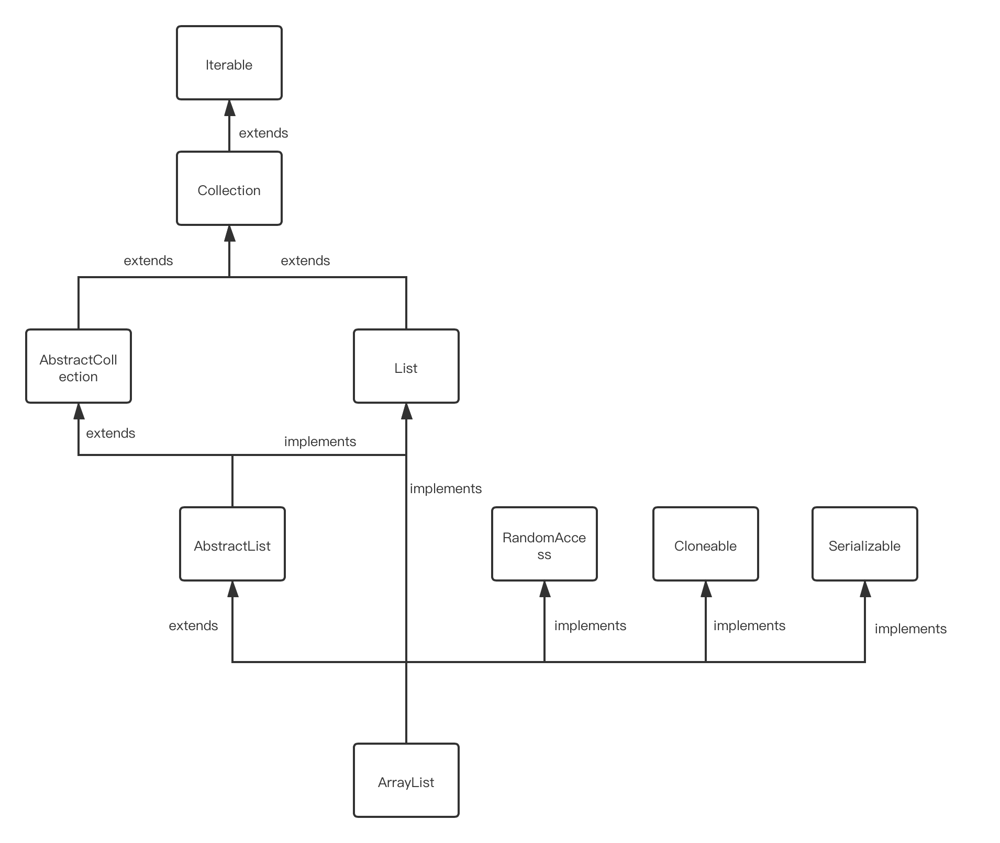

# Java Demo

## Java

- [BigDecimalTests](./src/main/java/com/fengwenyi/javademo/bigdecimaldemo/BigDecimalTests.java)：BigDecimal使用示例

## jdk 8

- [StreamTests](./src/main/java/com/fengwenyi/javademo/streamdemo/StreamTests.java)：Stream 流的使用示例
- [LocalDateTimeTests](./src/main/java/com/fengwenyi/javademo/localdatetimedemo/LocalDateTimeTests.java)：LocalDateTime 使用示例
  
## 并发

- [CountDownLatchTest](./src/main/java/com/fengwenyi/javademo/countdownlatchdemo/CountDownLatchTest.java)：CountDownLatch使用示例
  
## 线程池

- [DefaultThreadPoolTests](./src/main/java/com/fengwenyi/javademo/threadpooldemo/DefaultThreadPoolTests.java)：默认4种线程池
- [ThreadPoolRejectedTests](./src/main/java/com/fengwenyi/javademo/threadpooldemo/ThreadPoolRejectedTests.java)：线程池拒绝策略和自定义拒绝策略示例


## 二进制转换

## ArrayList



### 概述

底层基于数组实现，并且实现了动态扩容

### RandomAccess

这是一个标记接口，内部是空的，标记"实现了这个接口的类支持快速（通常是固定时间）随机访问"。

快速随机访问是什么意思呢？就是说，不需要遍历，就可以通过下标（索引）直接访问到内存地址。

```java
    public E get(int index) {
        rangeCheck(index);

        return elementData(index);
    }

    E elementData(int index) {
        return (E) elementData[index];
    }
```

### Cloneable

ArrayList实现了Cloneable接口，这表明ArrayList是支持拷贝的。

ArrayList内部的确也重写了Object类的clone()方法。

```java
    public Object clone() {
        try {
            ArrayList<?> v = (ArrayList<?>) super.clone();
            v.elementData = Arrays.copyOf(elementData, size);
            v.modCount = 0;
            return v;
        } catch (CloneNotSupportedException e) {
            // this shouldn't happen, since we are Cloneable
            throw new InternalError(e);
        }
    }
```

### Serializable

标记接口，内部也是空的，标记"实现了这个接口的类支持序列化"。
序列化是什么意思呢？Java的序列化是指,将对象转换成以字节序列的形式来表示，这些字节序列中包含了对象的字段和方法。
序列化后的对象可以被写到数据库、写到文件、也可用于网络传输。

ArrayList关键字段elementData使用了transient关键字修饰，这个关键字的作用是，让它修饰的字段不被序列化。
这不前后矛盾吗？一个类既然实现了Serializable接口，肯定是想要被序列化的，对吧？
那为什么保存关键数据的elementData又不想被序列化呢？

这还得从 "ArrayList是基于数组实现的" 开始说起。数组是定长的，就是说，数组一旦声明了，长度（容量）就是固定的。
这就很麻烦，数组一旦装满了，就不能添加新的元素进来了。

ArrayList 不能像数组这样活着，所以它实现了动态扩容。
一旦在添加元素的时候，发现容量用满了 `s == elementData.length` ，
就按照原来数组的 1.5倍 （oldCapacity >> 1） 进行扩容。
扩容之后，再将原来的数组复制到新分配的内存地址上。
`elementData = Arrays.copyOf(elementData, newCapacity)`

```java
    public boolean add(E e) {
        ensureCapacityInternal(size + 1);  // Increments modCount!!
        elementData[size++] = e;
        return true;
    }

    private void ensureCapacityInternal(int minCapacity) {
        ensureExplicitCapacity(calculateCapacity(elementData, minCapacity));
    }

    private void ensureExplicitCapacity(int minCapacity) {
        modCount++;

        // overflow-conscious code
        if (minCapacity - elementData.length > 0)
            grow(minCapacity);
    }

    private void grow(int minCapacity) {
        // overflow-conscious code
        int oldCapacity = elementData.length;
        int newCapacity = oldCapacity + (oldCapacity >> 1);
        if (newCapacity - minCapacity < 0)
            newCapacity = minCapacity;
        if (newCapacity - MAX_ARRAY_SIZE > 0)
            newCapacity = hugeCapacity(minCapacity);
        // minCapacity is usually close to size, so this is a win:
        elementData = Arrays.copyOf(elementData, newCapacity);
    }
```

动态扩容意味着什么？

意味着数组的实际大小可能永远无法被填满，总有多余出来空置的内存空间。

比如说，默认的数组大小是10，
当添加第11个元素的时候，数组的长度扩容了1.5倍，也就是15，
意味着还有4个内存空间是闲置的

序列化的时候，如果把整个数组都序列化的话，
是不是就多了4个内存空间。
当存储的元素数量非常非常多的时候，
闲置的空间就非常非常大，
序列化耗费的时间就会非常非常多。

于是，ArrayList做了一个愉快而又聪明的决定，
内部提供了两个私有方法 writeObject 和 readObject
来完成序列化和反序列化。

```java
    private void writeObject(java.io.ObjectOutputStream s)
        throws java.io.IOException{
        // Write out element count, and any hidden stuff
        int expectedModCount = modCount;
        s.defaultWriteObject();

        // Write out size as capacity for behavioural compatibility with clone()
        s.writeInt(size);

        // Write out all elements in the proper order.
        for (int i=0; i<size; i++) {
            s.writeObject(elementData[i]);
        }

        if (modCount != expectedModCount) {
            throw new ConcurrentModificationException();
        }
    }

    private void readObject(java.io.ObjectInputStream s)
        throws java.io.IOException, ClassNotFoundException {
        elementData = EMPTY_ELEMENTDATA;

        // Read in size, and any hidden stuff
        s.defaultReadObject();

        // Read in capacity
        s.readInt(); // ignored

        if (size > 0) {
            // be like clone(), allocate array based upon size not capacity
            int capacity = calculateCapacity(elementData, size);
            SharedSecrets.getJavaOISAccess().checkArray(s, Object[].class, capacity);
            ensureCapacityInternal(size);

            Object[] a = elementData;
            // Read in all elements in the proper order.
            for (int i=0; i<size; i++) {
                a[i] = s.readObject();
            }
        }
    }
```

从 writeObject 方法的源码可以看得出，
它使用了ArrayList 的实际大小 size，
而不是数组的长度（`elementData.length`）
来作为元素的上线进行序列化。

## LinkedList

## 目录

- [Collectors](./doc/Collectors.md) 【2021.01.04】

- [Function](./doc/Function.md) 【2021.01.04】
- [设计模式-责任链模式](./doc/设计模式-责任链模式.md) 【2021.10.21】